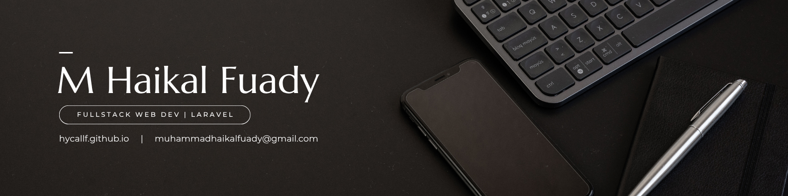

   
  <h1>Halo, Saya Muhammad Haikal Fuady 👋</h1>
  <h3>Fullstack Developer dengan Fokus Laravel</h3>
  

    
    
    

---

### 🚀 Tentang Saya
Seorang **Fullstack Developer** yang bersemangat dalam membangun solusi web yang efisien dan skalabel. Dengan latar belakang pendidikan di bidang IT dan pengalaman praktis dalam proyek-proyek *freelance*, saya memiliki minat kuat dalam memecahkan masalah kompleks melalui pendekatan logis dan matematis. Saya percaya bahwa fondasi kode yang solid adalah kunci keberhasilan setiap aplikasi.

Saya adalah seorang *lifelong learner* yang selalu mencari tantangan baru dan teknologi inovatif untuk terus mengasah kemampuan saya.

### 💻 Spesialisasi & Teknologi

Saya fokus pada pengembangan fullstack yang kuat, dengan keahlian mendalam di ekosistem **Laravel**. Saya juga terampil dalam membangun antarmuka pengguna yang interaktif.
saya sempat tertarik pada IOT dan GameDev juga tetapi tidak terlalu mendalam kesana, hanya sebagai Hobby.

* **Backend:**
    * **Laravel:** Framework favorit saya untuk membangun aplikasi web dan RESTful API yang robust.
    * Pernah mencoba Next.JS & Express.JS (MERN stack)
    * PHP, MySQL/MariaDB, PostgreSQL
    * Konsep API Design (RESTful), Authentication (Sanctum)
* **Frontend:**
    * Vue.js (SPA Development)
    * HTML, CSS (Tailwind CSS/Bootstrap), JavaScript (ES6+)
    * Alpine.js, Livewire (untuk solusi Fullstack Laravel)
* **Tools & Lainnya:**
    * Git & GitHub, Composer, NPM/Yarn
    * VS Code, Postman/Insomnia
    * Konsep Database Schema Design, Query Optimization

### 💡 Portofolio
Berikut adalah portofolio projek yang menunjukkan keahlian saya:

### 🧑🏻‍💻 Tulisan saya

### 🌱 Saya Sedang Belajar
Saya berkomitmen untuk terus berkembang dan memperluas pengetahuan saya di dunia teknologi:
* [DevOps & Deployment otomatis (CI/CD)]
* [Progressive Web Apps]
* [Pemrograman Mobile (Flutter/Java/Kotlin)]
* [Arsitektur Microservices]

### 🤝 Mari Berkolaborasi
Saya terbuka untuk peluang kerja sebagai **Junior/Associate Backend/Fullstack Developer** di perusahaan yang mencari talenta yang cepat belajar dan berkomitmen. Saya juga bersedia untuk proyek *freelance* yang menantang dan kolaborasi *open source*.

Feel free to connect with me!

---
